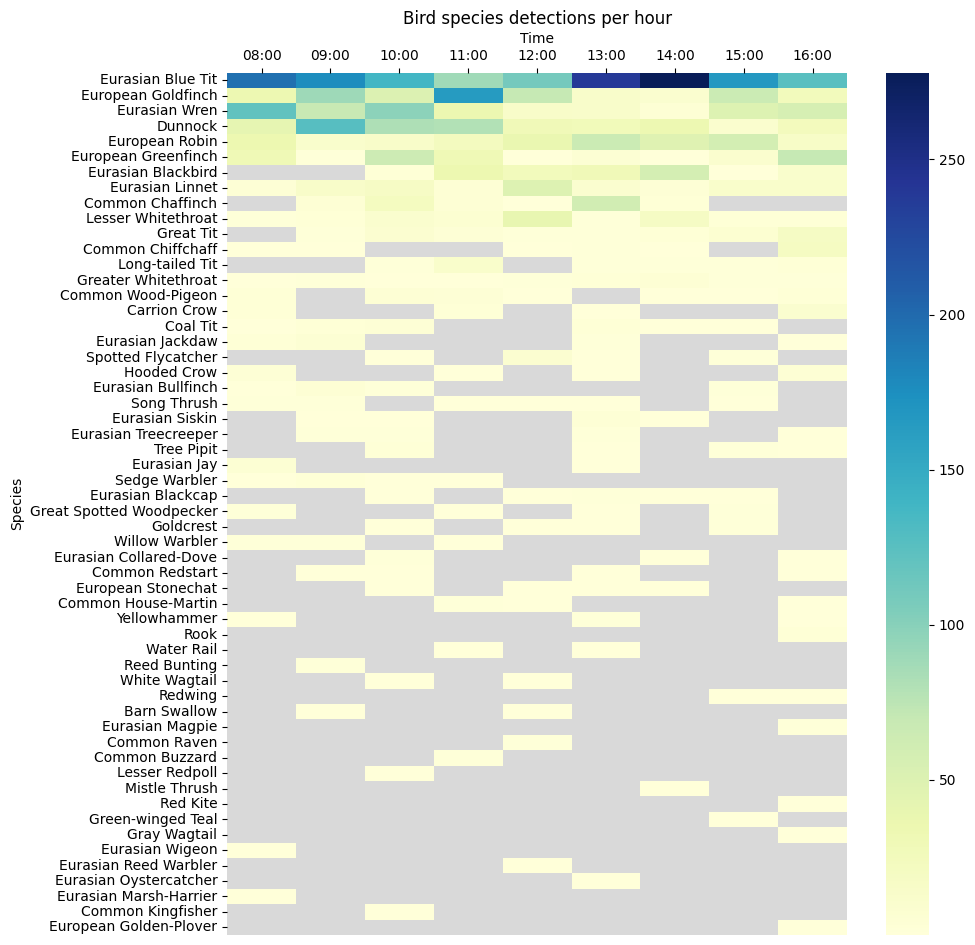
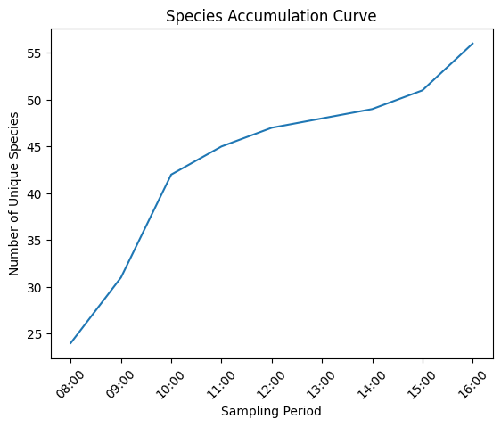

# BirdNet test

This is a small repository containing code to identify bird species from audio recordings.  The intended environment is Google Colab.

Figure 1. This shows the number of bird species classifications as a function of the time in which the recording was made.

Figure 2. This shows the species accumulation curve for bird species classification as a function of sampling effort.
